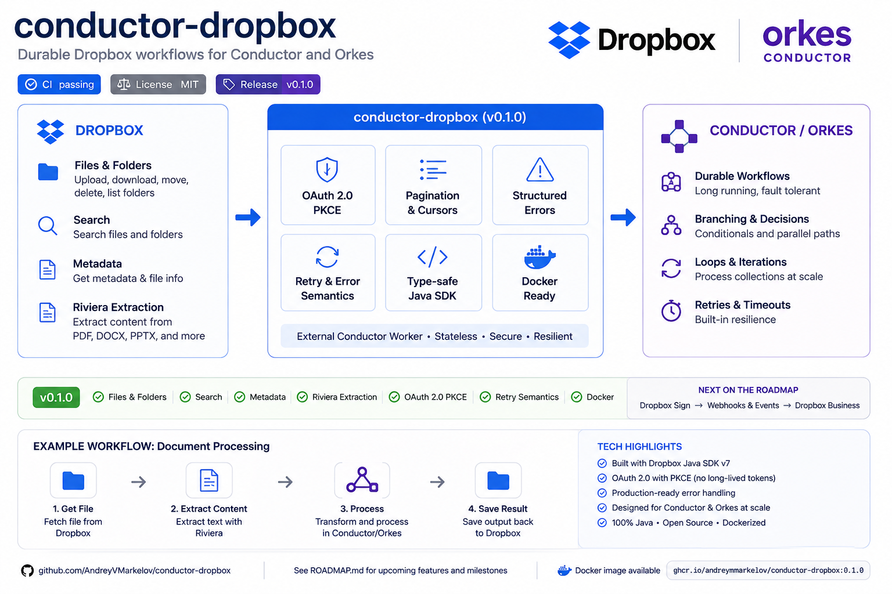

# conductor-dropbox

[](https://github.com/AndreyVMarkelov/conductor-dropbox/actions/workflows/ci.yml)
[](LICENSE)
[](https://github.com/AndreyVMarkelov/conductor-dropbox/releases)

Dropbox integration for Conductor and Orkes workflows.

Build durable workflows around Dropbox files, folders, search, and document processing without writing Dropbox API glue for every workflow.

`conductor-dropbox` runs as an external Conductor worker and can be used with self-hosted Conductor or Orkes.



## Features

- List Dropbox files and folders
- Cursor-based folder pagination
- Get file and folder metadata
- Search files and folders with path scoping and cursor pagination
- Upload and download files
- Create folders
- Move and rename files and folders
- Delete files and folders
- Extract Markdown from documents with Dropbox Riviera
- Run asynchronous Riviera extraction jobs
- OAuth 2.0 with automatic access-token refresh
- PKCE login without an app secret
- Structured Dropbox error handling
- Retry-aware task behavior
- Docker deployment
- Ready-to-run workflow examples

## Why conductor-dropbox?

Conductor provides durable workflow orchestration, retries, branching, loops, and long-running execution.

Dropbox provides the files and content.

`conductor-dropbox` connects the two:

```text
Conductor / Orkes
       │
       ▼
conductor-dropbox
       │
       ├── Files and folders
       ├── Search
       ├── Metadata
       ├── Upload / download
       └── Riviera document extraction
       │
       ▼
    Dropbox
```

The worker remains separate from the Conductor server, so it can be deployed and upgraded independently.

## Available tasks

| Task | Description |
| --- | --- |
| `dropbox_list_folder` | List files and folders, with cursor continuation |
| `dropbox_get_metadata` | Get metadata for a file or folder |
| `dropbox_search` | Search files and folders, with path scope and cursor pagination |
| `dropbox_create_folder` | Create a folder |
| `dropbox_move` | Move or rename a file or folder |
| `dropbox_delete` | Delete a file or folder |
| `dropbox_upload_file` | Upload a file |
| `dropbox_download_file` | Download a file |
| `dropbox_extract_markdown` | Extract Markdown with Dropbox Riviera |
| `dropbox_extract_markdown_async_start` | Start asynchronous Markdown extraction |
| `dropbox_extract_markdown_async_check` | Check an asynchronous extraction job |

See [`examples/taskdefs`](examples/taskdefs) for task definitions.

## Requirements

- Java 21
- Conductor or Orkes
- A Dropbox app with the scopes required by the operations you use

Docker can be used instead of installing Java locally.

## Quick start

### 1. Configure Dropbox authentication

For a long-running worker, use a Dropbox app key and refresh token:

```sh
export DROPBOX_APP_KEY=your_app_key
export DROPBOX_REFRESH_TOKEN=your_refresh_token
```

### 2. Start Conductor

Make sure your Conductor API is available.

The default expected URL is:

```text
http://localhost:8080/api
```

### 3. Start the worker

```sh
./gradlew run
```

The worker will connect to Conductor and begin polling the registered Dropbox task types.

## Authentication

`conductor-dropbox` supports refresh-token authentication and direct access-token authentication.

### Recommended: refresh token

Configure:

```sh
export DROPBOX_APP_KEY=your_app_key
export DROPBOX_REFRESH_TOKEN=your_refresh_token
```

The Dropbox Java SDK obtains short-lived access tokens and refreshes them automatically.

This is the recommended authentication mode for long-running workers and deployed environments.

### PKCE OAuth login

The project includes a PKCE login helper for obtaining a Dropbox refresh token without configuring an app secret.

Set your Dropbox app key:

```sh
export DROPBOX_APP_KEY=your_app_key
```

Run:

```sh
./gradlew dropboxLogin
```

The command prints a Dropbox authorization URL.

Open the URL, authorize the Dropbox app, copy the authorization code, and paste it into the terminal.

After authorization, the helper prints values that can be exported:

```sh
export DROPBOX_APP_KEY=...
export DROPBOX_REFRESH_TOKEN=...
```

Then start the worker:

```sh
./gradlew run
```

### Development: access token

For short-lived local development, an access token can be supplied directly:

```sh
export DROPBOX_ACCESS_TOKEN=your_access_token
```

If refresh-token credentials and an access token are both configured, refresh-token authentication takes precedence.

## Runtime configuration

| Environment variable | Required | Default | Description |
| --- | --- | --- | --- |
| `DROPBOX_APP_KEY` | For refresh-token auth | — | Dropbox application key |
| `DROPBOX_REFRESH_TOKEN` | For refresh-token auth | — | Dropbox OAuth refresh token |
| `DROPBOX_ACCESS_TOKEN` | No | — | Direct access token for development |
| `CONDUCTOR_URL` | No | `http://localhost:8080/api` | Conductor API URL |
| `WORKER_THREAD_COUNT` | No | `2` | Number of worker threads |

`WORKER_THREAD_COUNT` must be a positive integer.

## Docker

Build the image:

```sh
docker build -t conductor-dropbox:local .
```

When Conductor is running directly on the host, start the worker with:

```sh
docker run --rm \
  -e CONDUCTOR_URL=http://host.docker.internal:8080/api \
  -e DROPBOX_APP_KEY="$DROPBOX_APP_KEY" \
  -e DROPBOX_REFRESH_TOKEN="$DROPBOX_REFRESH_TOKEN" \
  -e WORKER_THREAD_COUNT=2 \
  conductor-dropbox:local
```

For development with a direct access token:

```sh
docker run --rm \
  -e CONDUCTOR_URL=http://host.docker.internal:8080/api \
  -e DROPBOX_ACCESS_TOKEN="$DROPBOX_ACCESS_TOKEN" \
  conductor-dropbox:local
```

The worker can also connect to a remote Conductor or Orkes endpoint by setting `CONDUCTOR_URL`.

## Pagination

Dropbox folder listing and search expose pagination rather than hiding multiple Dropbox API calls inside a single worker execution.

### List folder

Initial request:

```json
{
  "path": "/Documents",
  "recursive": false,
  "includeDeleted": false
}
```

Example output:

```json
{
  "entries": [
    {
      "type": "file",
      "id": "id:...",
      "name": "report.pdf",
      "pathLower": "/documents/report.pdf",
      "pathDisplay": "/Documents/report.pdf",
      "rev": "...",
      "size": 12345,
      "contentHash": "..."
    }
  ],
  "cursor": "...",
  "hasMore": true
}
```

Continue with:

```json
{
  "cursor": "..."
}
```

When a cursor is supplied, it takes precedence over the initial listing parameters.

### Search

Initial request:

```json
{
  "query": "invoice",
  "path": "/Documents",
  "maxResults": 50
}
```

Example output:

```json
{
  "matches": [],
  "cursor": "...",
  "hasMore": true
}
```

Continue with:

```json
{
  "cursor": "..."
}
```

The Dropbox cursor preserves the original search state.

## Dropbox Riviera

Dropbox Riviera can extract Markdown from supported documents stored in Dropbox.

This makes it possible to build document and AI workflows without downloading files and maintaining a separate document parsing stack.

Example:

```text
Dropbox Folder
      │
      ▼
 List Folder
      │
      ▼
   For Each
      │
      ▼
Extract Markdown
      │
      ▼
 AI / LLM / RAG
```

The project supports both synchronous and asynchronous extraction flows.

Asynchronous extraction is handled carefully so that workflow retries do not blindly create duplicate extraction jobs.

## Error handling

Dropbox SDK errors are converted into stable workflow-level error categories.

Examples include:

| Error | Retryable |
| --- | --- |
| Authentication failure | No |
| Path not found | No |
| Path conflict | No |
| Permission denied | No |
| Invalid input | No |
| Quota exceeded | No |
| Rate limited | Yes |
| Temporary Dropbox failure | Yes |
| Network failure | Yes |

Workers expose structured output describing the error, operation, and whether retrying is appropriate.

This prevents permanent failures such as an expired or invalid credential from being retried as generic network errors.

## Workflow examples

Ready-to-run task definitions, workflow definitions, and screenshots are available under:

[`examples/workflows`](examples/workflows/README.md)

### Process Dropbox Folder

Lists a Dropbox folder, iterates entries sequentially, skips folders, and extracts Markdown from files with Dropbox Riviera.

```text
List Folder
     │
     ▼
  For Each
     │
     ▼
   File?
     │
     ▼
Extract Markdown
```

### File Organizer

Routes incoming files by extension and moves them into destination folders.

```text
Incoming
    │
    ▼
List Folder
    │
    ▼
 For Each
    │
    ▼
Route File
  / | \
 /  |  \
Data Documents Other
```

These examples exercise real Dropbox operations through Conductor rather than mocked workflow tasks.

## Register task definitions

Task definitions are stored under `examples/taskdefs`.

For example:

```sh
jq -s '.' \
  examples/taskdefs/dropbox-list-folder.json \
  examples/taskdefs/dropbox-get-metadata.json \
  examples/taskdefs/dropbox-search.json \
  | curl -s -X POST \
      http://localhost:8080/api/metadata/taskdefs \
      -H 'Content-Type: application/json' \
      -d @-
```

Individual workflow examples contain the task-definition registration commands required for that workflow.

## Architecture

The worker runtime is intentionally small:

```text
Environment / Secret Manager
          │
          ▼
DropboxCredentialsProvider
          │
          ▼
DropboxClientProvider
          │
          ▼
     Dropbox Workers
          │
     ┌────┴────┐
     ▼         ▼
Conductor    Dropbox
```

Authentication, Dropbox API behavior, and workflow orchestration remain separate concerns.

This also leaves room for other credential providers without coupling individual workers to environment variables or a specific deployment platform.

## Orkes Connected App

The repository also contains a proposal for a native Dropbox Connected App for Orkes:

[`docs/orkes-connected-app-proposal.md`](docs/orkes-connected-app-proposal.md)

The OSS worker and a native Connected App serve different deployment models.

`conductor-dropbox` can continue to support self-hosted Conductor and independently deployed workers, while a native Connected App could expose Dropbox operations directly inside Orkes with Orkes-managed authentication.

The current project acts as a working reference implementation for the proposed integration.

## Development

Run the test suite:

```sh
./gradlew check
```

Run the worker:

```sh
./gradlew run
```

Build the application distribution:

```sh
./gradlew installDist
```

Build the Docker image:

```sh
docker build -t conductor-dropbox:local .
```

## Project status

See [`ROADMAP.md`](ROADMAP.md) for planned Dropbox Sign, webhooks, durable events, and Dropbox Business support.

The project is under active development.

The initial release focuses on:

- core Dropbox file and folder operations
- metadata
- search
- cursor pagination
- reliable workflow error semantics
- OAuth and refresh-token authentication
- Dropbox Riviera document processing
- Docker deployment
- end-to-end workflow examples

Potential future work includes Dropbox team authentication, member-scoped execution, team namespace support, shared links, revisions, restore, metadata, batch operations, and change-driven workflows.

## Security

Do not commit Dropbox access tokens, refresh tokens, app credentials, or other secrets to the repository.

Use environment variables or your deployment platform's secret-management mechanism.

If you discover a security issue, please report it privately rather than opening a public issue with exploit details.

## License

See [`LICENSE`](LICENSE).