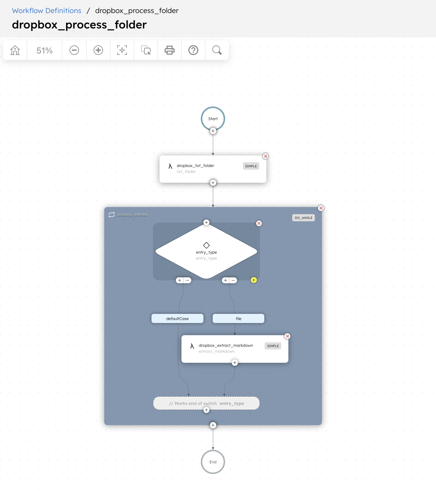
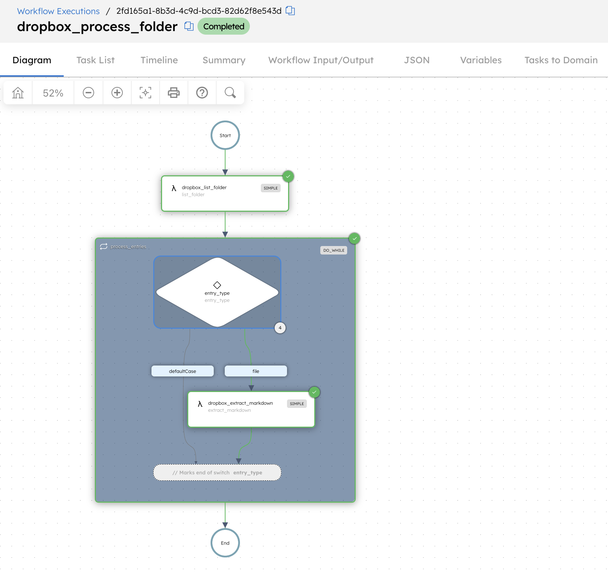
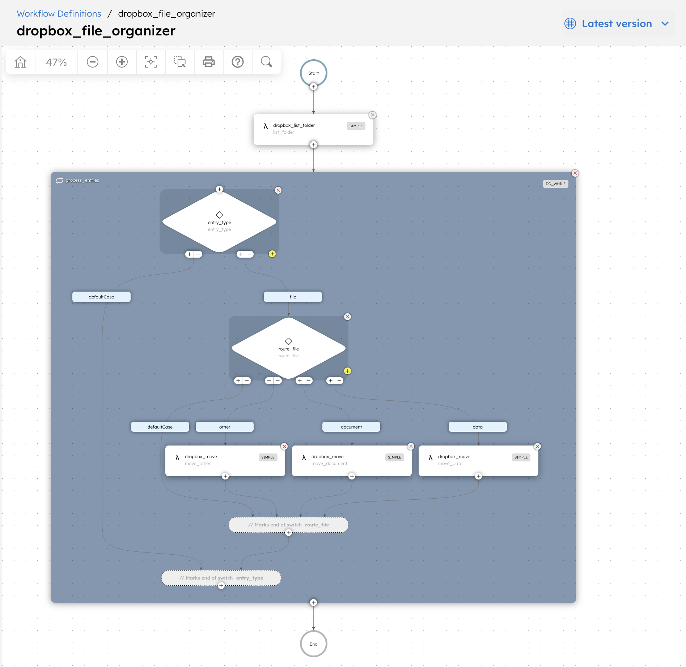
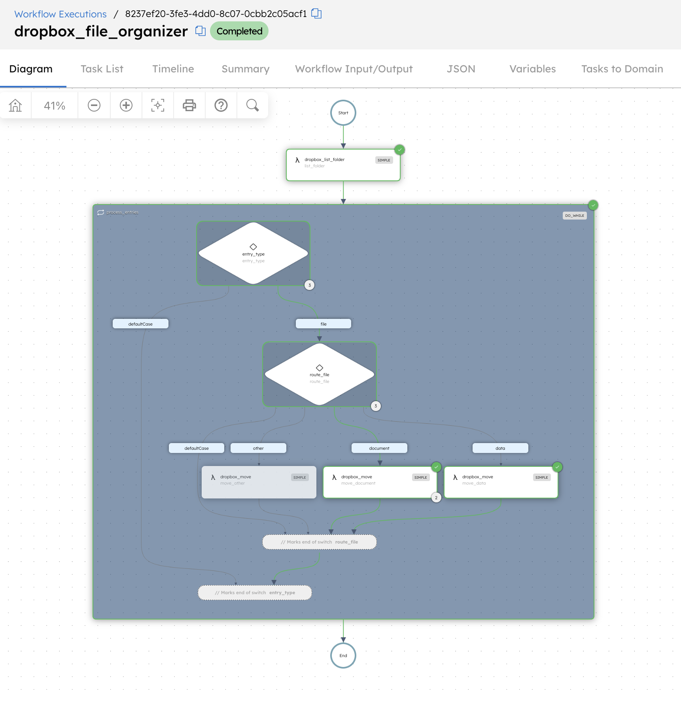

# Workflow Examples

## Process Dropbox Folder

`process-folder.json` demonstrates how to:

- list a Dropbox folder
- iterate entries sequentially
- skip folders
- extract Markdown from files with Dropbox Riviera

### Workflow



### Successful execution



### Register task definitions

```sh
jq -s '.' \
  examples/taskdefs/dropbox-list-folder.json \
  examples/taskdefs/dropbox-extract-markdown.json \
  | curl -s -X POST \
      http://localhost:8080/api/metadata/taskdefs \
      -H 'Content-Type: application/json' \
      -d @-
```

### Register workflow

```sh
curl -s -X POST \
  http://localhost:8080/api/metadata/workflow \
  -H 'Content-Type: application/json' \
  -d @examples/workflows/process-folder.json
```

### Run

```sh
curl -s -X POST \
  'http://localhost:8080/api/workflow/dropbox_process_folder?version=1' \
  -H 'Content-Type: application/json' \
  -d '{
    "path": "/conductor-dropbox-tests"
  }'
```

The workflow processes entries one by one. Folder entries are skipped. File entries are passed to `dropbox_extract_markdown`.

`dropbox_extract_markdown` uses `retryCount: 0` because retrying the whole task can launch a new Riviera extraction job.


---

## File Organizer

`file-organizer.json` demonstrates how to:

- list files from an incoming Dropbox folder
- iterate files sequentially
- route files by extension
- move files into destination folders

Routing used by the example:

- `.csv` → `/file-organizer/Data`
- `.pdf` and `.txt` → `/file-organizer/Documents`
- everything else → `/file-organizer/Other`

### Workflow



### Successful execution



### Register task definitions

```sh
jq -s '.' \
  examples/taskdefs/dropbox-list-folder.json \
  examples/taskdefs/dropbox-move.json \
  | curl -s -X POST \
      http://localhost:8080/api/metadata/taskdefs \
      -H 'Content-Type: application/json' \
      -d @-
```

### Register workflow

```sh
curl -s -X POST \
  http://localhost:8080/api/metadata/workflow \
  -H 'Content-Type: application/json' \
  -d @examples/workflows/file-organizer.json
```

### Run

```sh
curl -s -X POST \
  'http://localhost:8080/api/workflow/dropbox_file_organizer?version=1' \
  -H 'Content-Type: application/json' \
  -d '{
    "path": "/file-organizer/Incoming"
  }'
```

The workflow processes files one by one and routes them using a JavaScript `SWITCH` expression before calling `dropbox_move`.
